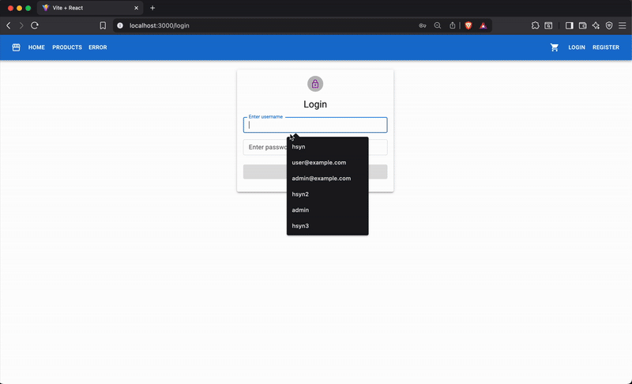

# 🛍️ Store App - E-Commerce Application

A modern e-commerce application. A comprehensive online store developed with React frontend and Node.js backend.

## Preview

A preview of my store-app project is in the gif below.



## ✨ Features

### 🛒 User Features

- **Product Catalog**: Product list by categories
- **Product Details**: Detailed product information and images
- **Cart Management**: Add, remove and update product quantities
- **User Account**: Registration, login and profile management
- **Order History**: View previous orders
- **Secure Payment**: Checkout with address and payment information

### 🔧 Technical Features

- **Responsive Design**: Mobile and desktop compatible
- **State Management**: Centralized state management with Redux Toolkit
- **Form Validation**: Form control with React Hook Form
- **API Integration**: Backend communication with RESTful API
- **Route Protection**: Secure page access with AuthGuard
- **Error Handling**: Comprehensive error pages and messages

## 🚀 Installation

### Backend Installation

```bash
cd store-api
npm install
npm start
```

Backend will run on `http://localhost:5000` by default.

### Frontend Installation

```bash
cd store-client
npm install
npm run dev
```

Frontend will run on `http://localhost:3000` by default.

## 🛠️ Technologies Used

### Frontend

- **React 18** - UI library
- **Vite** - Build tool and dev server
- **Material-UI** - UI component library
- **Redux Toolkit** - State management
- **React Router** - Page routing
- **React Hook Form** - Form management
- **Axios** - HTTP client

### Backend

- **Node.js** - Runtime environment
- **Express.js** - Web framework
- **JSON Server** - Mock API server
- **CORS** - Cross-origin resource sharing

## 📱 Screenshots

### Homepage

- Product catalog and featured products
- Navigation menu and cart status

### Product Details

- Product images and descriptions
- Add to cart button
- Stock status

### Cart

- Product list and quantities
- Total price calculation
- Checkout redirection

### User Panel

- Login/register forms
- User menu (orders, logout)
- Profile management

## 🔐 Security

- **JWT Token** based authentication
- **Protected Routes** for page access control
- **Form Validation** for data validation
- **CORS** configuration

## 📝 API Endpoints

### User Operations

- `POST /api/account/login` - Login
- `POST /api/account/register` - Register
- `GET /api/account` - User information

### Product Operations

- `GET /api/products` - All products
- `GET /api/products/:id` - Product details

### Cart Operations

- `GET /api/cart` - Cart contents
- `POST /api/cart` - Add item to cart
- `DELETE /api/cart/:id` - Remove item from cart

### Order Operations

- `GET /api/orders` - User orders
- `POST /api/orders` - Create new order
